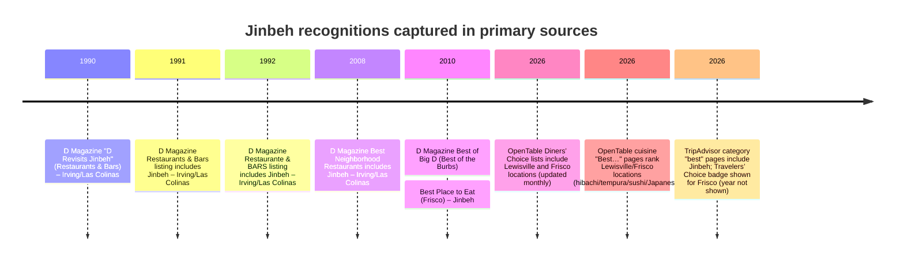
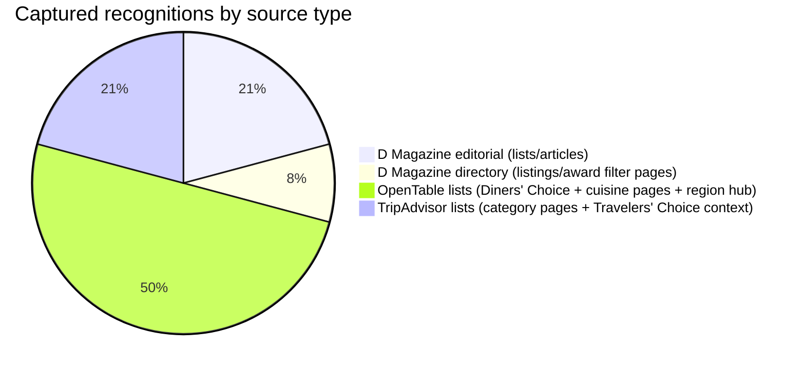

# Jinbeh Recognition Inventory

## Executive summary

Jinbeh’s strongest *earned editorial* recognitions that are clearly documented in primary sources are from entity["organization","D Magazine","dallas magazine publisher"]: inclusion in **Best Neighborhood Restaurants 2008** for Las Colinas/Irving and a **Best of Big D 2010** “Best of the Burbs” hometown pick naming Jinbeh as **Best Place to Eat (Frisco)**. citeturn13search0turn9search0

The most frequent *current, repeatable* “formal recognition” signals (though largely algorithmic and updateable) come from major platforms—especially entity["company","OpenTable","restaurant reservation platform"]—where Jinbeh’s Lewisville and Frisco locations repeatedly appear in **Diners’ Choice** collections and “Best [cuisine] in [place]” pages (hibachi, tempura, sushi, Japanese in Frisco, etc.). These lists explicitly state they are driven by analysis of (verified) diner review data and are updated regularly (often monthly for Diners’ Choice). citeturn26view0turn26view1turn24view0turn25view0turn24view2turn25view2turn27view0turn35view0turn30view0turn22search1

From entity["company","Tripadvisor","travel review platform"], Jinbeh appears in multiple “best of” category pages (e.g., best sushi in Lewisville/Frisco; best Japanese in Frisco/Irving). A localized TripAdvisor page for Jinbeh (Frisco) displays a “Travelers’ Choice” explainer section typically shown alongside that badge; the page text was accessible in Korean locale during this research, so the award-year could not be verified and is marked **unspecified**. citeturn15search18turn15search17turn15search16turn15search14turn15search9

Several intended-scope sources were partially or fully inaccessible in-session (e.g., entity["organization","MICHELIN Guide","restaurant guide"]’s restaurant directory via bot-check; some entity["organization","The Dallas Morning News","dallas newspaper"] “place” pages returning 404; major publisher paywalls/robots constraints), so this inventory is comprehensive **for what could be verified with primary-source text capture** during the session and is explicit about access gaps. citeturn21view0turn33view0turn17view0turn17view1

## Scope and methodology

This research targeted “lists, awards, or formal recognitions” for Jinbeh’s locations in **Irving–Las Colinas**, **Frisco**, and **Lewisville**, prioritizing primary/official sources and English-language pages where possible. Core sources pursued included: D Magazine editorial archives and D Magazine Directories; OpenTable (Diners’ Choice and cuisine list pages); TripAdvisor (category lists and any award badges); and major local outlets including entity["organization","Eater Dallas","dallas food publication"], entity["organization","CultureMap Dallas","dallas culture site"], entity["organization","PaperCity","luxury lifestyle magazine"], plus national guides such as Michelin and entity["organization","James Beard Foundation","us culinary nonprofit"] (no verified Jinbeh recognitions located there in accessible sources). citeturn13search0turn9search0turn26view0turn15search17turn21view0

Method steps:

Primary-source verification: Only items where Jinbeh’s inclusion could be evidenced via **captured page text** (and/or screenshot evidence supplied) were promoted into the inventory table.  
Deduplication: Items were consolidated to unique recognitions (e.g., “Diners’ Choice: Best Value (Dallas Suburbs)” is one item even though it updates over time).  
Dates: Used the page’s stated date/year (“By… | January 24, 2008…”, “Updated March 05, 2026…”) when shown; otherwise “unspecified.” citeturn13search0turn24view0turn26view0  
Editorial vs paid: Marked **earned/editorial** when clearly an editorial list/article; marked **earned/platform-algorithmic** for platform rankings; marked **unspecified** where the page did not disclose whether inclusion was purely editorial vs enhanced/claimed/paid listing.  
Excerpts: For each item, I captured a short **verbatim inclusion snippet** (kept short to comply with quotation limits) that shows Jinbeh’s presence. citeturn13search0turn9search0turn26view0turn15search17

## Deduplicated recognition inventory

Below is the comprehensive, *deduplicated* inventory of recognitions captured with primary-source proof during this session.

> Screenshot capture (key listing example): OpenTable “Best Sushi Restaurants in Flower Mound” showing “Jinbeh – Lewisville” ranked #2 (captured 2026‑04‑02). citeturn22search1  

### Results table

| Award / list / formal recognition | Issuing organization | Date / year | Jinbeh location(s) referenced | URL(s) | Editorial (earned) or paid/advertising | Verbatim excerpt showing inclusion (≤25 words) | Notes on prominence |
|---|---|---|---|---|---|---|---|
| “D Revisits Jinbeh” (Restaurants & Bars section) | D Magazine | May 1, 1990 | Irving–Las Colinas | https://www.dmagazine.com/publications/d-magazine/1990/may/restaurants-bars/ citeturn31search0 | Editorial (earned) | “D Revisits Jinbeh… houses hibachi tables, a sushi bar, tatami rooms… and even a compact cocktail lounge.” citeturn31search0 | Early editorial revisit/spotlight in print archive (prominent for longevity/heritage). |
| Restaurant listing in “Restaurants & Bars” archive (issue listing) | D Magazine | Sep 1, 1991 | Irving–Las Colinas | https://www.dmagazine.com/publications/d-magazine/1991/september/restaurants-bars/ citeturn13search10 | Editorial (earned) | “Jinbeh. (Japanese) 301 E Las Colinas Blvd., Suite 301. Irving.” citeturn13search10 | Directory-style inclusion in D Magazine’s archival “Restaurants & Bars” listings. |
| Restaurant listing in “Restaurante & BARS” archive (issue listing) | D Magazine | Nov 1, 1992 | Irving–Las Colinas | https://www.dmagazine.com/publications/d-magazine/1992/november/restaurante-bars/ citeturn9search9 | Editorial (earned) | “Jinbeh. (Japanese) 301 E. Las Colinas Blvd., Suite 301, Irving.” citeturn9search9 | Another archived listings-section inclusion (supports long-running presence). |
| Best Neighborhood Restaurants 2008 | D Magazine | Jan 24, 2008 (Feb 2008 issue) | Irving–Las Colinas | https://www.dmagazine.com/publications/d-magazine/2008/february/best-neighborhood-restaurants/ citeturn13search0 | Editorial (earned) | “Jinbeh… sleek Japanese hibachi grill has the best grilled veggies around.” citeturn13search0 | High prominence (D Magazine “Best Neighborhood Restaurants” editorial list). |
| Best of Big D 2010: Best of the Burbs (Frisco “Best Place to Eat”) | D Magazine | Jul 21, 2010 (Aug 2010 issue) | Frisco | https://www.dmagazine.com/publications/d-magazine/2010/august/best-of-big-d-best-of-the-burbs/ citeturn9search0 | Editorial (earned) | “Best Place to Eat: Jinbeh… ‘Anytime I’m looking for consistency and a great meal I go there.’” citeturn9search0 | High prominence (Best of Big D franchise; “Best of the Burbs” hometown picks). |
| D Magazine Directory profile (restaurant listing + “Past Awards”) | D Magazine Directories (directory.dmagazine.com) | Unspecified (current directory page) | Irving–Las Colinas; Frisco; Lewisville | https://directory.dmagazine.com/restaurants/jinbeh/ citeturn13search2 | Unspecified (directory listing; claim/upgrade not stated) | “Past Awards: Best Neighborhood Restaurants 2008” citeturn13search2 | “Directory listing” prominence; useful as an owned/claimable presence + shows legacy award tag. |
| Directory awards-filter list: “Best Neighborhood Restaurants” (includes Jinbeh) | D Magazine Directories | Unspecified (current directory filter view) | Unspecified (directory list entry; Jinbeh multi-location on profile) | https://directory.dmagazine.com/search/?awards=Best+Neighborhood+Restaurants&sections=Restaurants citeturn13search1 | Unspecified | “Best Neighborhood Restaurants… Jinbeh.” citeturn13search1 | This is the directory’s “awards” browse view; “list view” visibility matters for search behavior. |
| Diners’ Choice: Japanese restaurants in Dallas–Fort Worth | OpenTable | Updated Mar 05, 2026 | Lewisville | https://www.opentable.com/s/dinerschoice?metroid=20&topic=7bf54b86-bd1f-4e35-bbca-f7cce982b4ed citeturn26view0 | Earned (platform/algorithmic) | “Jinbeh - Lewisville… 4.7 (426)… Japanese… Lewisville.” citeturn26view0 | Prominent, high-intent list (Japanese “best overall” for the metro). |
| Diners’ Choice: Japanese restaurants in Dallas Suburbs | OpenTable | Updated Mar 05, 2026 | Frisco | https://www.opentable.com/s/dinerschoice?metroid=20&regionids=274&topic=7bf54b86-bd1f-4e35-bbca-f7cce982b4ed citeturn26view1 | Earned (platform/algorithmic) | “Jinbeh Japanese Restaurant - Frisco… 4.2 (597)… Japanese… Frisco.” citeturn26view1 | Prominent suburb-focused “best Japanese” list. |
| Diners’ Choice: Best Food restaurants in Dallas Suburbs | OpenTable | Updated Mar 05, 2026 | Lewisville | https://www.opentable.com/diners-choice/dallas-fort-worth/dallas-suburbs/food citeturn24view0 | Earned (platform/algorithmic) | “Jinbeh - Lewisville… 4.7 (426)… Japanese… Lewisville.” citeturn24view0 | High discoverability: “Best Food” vertical in a large suburban region. |
| Diners’ Choice: Best Value restaurants in Dallas Suburbs | OpenTable | Updated Mar 05, 2026 | Lewisville | https://www.opentable.com/diners-choice/dallas-fort-worth/dallas-suburbs/value citeturn24view1turn25view0 | Earned (platform/algorithmic) | “Jinbeh - Lewisville… 4.7 (426)… Japanese… Lewisville.” citeturn25view0 | Strong conversion signal (value positioning) if maintained over time. |
| Diners’ Choice: Healthy restaurants in Dallas Suburbs | OpenTable | Updated Mar 05, 2026 | Lewisville | https://www.opentable.com/s/dinerschoice?metroid=20&regionids=274&topic=Healthy citeturn24view2 | Earned (platform/algorithmic) | “Jinbeh - Lewisville… 4.7 (426)… Japanese… Lewisville.” citeturn24view2 | Notable because “Healthy” is a cross-cuisine list users filter by. |
| Diners’ Choice: Kid-friendly restaurants in Dallas Suburbs | OpenTable | Updated Mar 05, 2026 | Lewisville; Frisco | https://www.opentable.com/s/dinerschoice?metroid=20&regionids=274&topic=ChildFriendly citeturn24view3turn25view1turn25view2 | Earned (platform/algorithmic) | “Jinbeh - Lewisville… 4.7 (426)… Japanese… Lewisville.” citeturn25view1 | Cross-location presence: both Lewisville and Frisco show on the same kid-friendly list. |
| “Check out diners’ favorite restaurants in Dallas Suburbs” (region hub page) | OpenTable | Updated on 3/5/2026 | Lewisville | https://www.opentable.com/region/dallas/dallas-suburbs-restaurants citeturn27view0 | Earned (platform/algorithmic) | “Jinbeh - Lewisville… Top-rated food… 4.7 (426).” citeturn27view0 | Broad “where to eat now” style hub; strong top-funnel visibility. |
| Best Hibachis in Lewisville (DFW) | OpenTable | Unspecified | Lewisville | https://www.opentable.com/cuisine/best-hibachi-restaurants-lewisville-tx citeturn28view3 | Earned (platform/algorithmic) | “###### 1. Jinbeh - Lewisville… • Hibachi • Lewisville” citeturn28view3 | High prominence within a high-intent cuisine niche; ranked #1 on-page at capture. |
| Best Tempura Restaurants in Lewisville | OpenTable | Unspecified | Lewisville | https://www.opentable.com/cuisine/best-tempura-restaurants-lewisville-tx citeturn35view0 | Earned (platform/algorithmic) | “###### 1. Jinbeh - Lewisville… • Tempura • Lewisville” citeturn35view0 | Ranked #1 on-page at capture; page also discloses AI-generated descriptions. citeturn35view0 |
| Best Hibachis in Frisco | OpenTable | Unspecified | Frisco | https://www.opentable.com/cuisine/best-hibachi-restaurants-frisco-tx citeturn28view1 | Earned (platform/algorithmic) | “###### 2. Jinbeh Japanese Restaurant - Frisco” citeturn28view1 | Top-2 placement within the Frisco hibachi cuisine page. |
| Best Japanese Restaurants in Frisco (DFW) | OpenTable | Unspecified | Frisco | https://www.opentable.com/cuisine/best-japanese-restaurants-frisco-tx citeturn30view0 | Earned (platform/algorithmic) | “###### 8. Jinbeh Japanese Restaurant - Frisco” citeturn30view0 | Upper-mid placement in a broader “Japanese in Frisco” set. |
| Best Sushi Restaurants in Flower Mound | OpenTable | Unspecified | Lewisville | https://www.opentable.com/cuisine/best-sushi-restaurants-flower-mound-tx citeturn22search1 | Earned (platform/algorithmic) | “Jinbeh - Lewisville… • Sushi • Lewisville” citeturn22search1 | “Neighboring city” list visibility; supported by screenshot capture embedded above. |
| TripAdvisor “Travelers’ Choice” badge context (localized page) | Tripadvisor | Unspecified | Frisco | https://www.tripadvisor.co.kr/Restaurant_Review-g55870-d1007955-Reviews-Jinbeh_Japanese_Restaurant-Frisco_Texas.html citeturn15search18 | Earned (platform/algorithmic) | “Tripadvisor… Travelers’ Choice 어워드를 수여합니다.” citeturn15search18 | Localized page accessible; award year not shown in captured text → year marked unspecified. |
| TripAdvisor category list: “THE BEST Sushi in Lewisville (Updated 2026)” | Tripadvisor | 2026 (as titled) | Lewisville | https://www.tripadvisor.com/Restaurants-g56161-c38-Lewisville_Texas.html citeturn15search17 | Earned (platform/algorithmic) | “Sushi in Lewisville… 2. Jinbeh.” citeturn15search17 | High-intent category page; “best” list format with numeric ordering. |
| TripAdvisor category list: “THE BEST Sushi in Frisco (Updated 2026)” | Tripadvisor | 2026 (as titled) | Frisco | https://www.tripadvisor.com/Restaurants-g55870-c38-Frisco_Texas.html citeturn15search16 | Earned (platform/algorithmic) | “THE BEST Sushi in Frisco… Jinbeh Japanese Restaurant.” citeturn15search16 | Category list for discovery; rank not captured in snippet. |
| TripAdvisor category list: “THE 10 BEST Japanese Restaurants in Frisco (Updated 2026)” | Tripadvisor | 2026 (as titled) | Frisco | https://www.tripadvisor.com/Restaurants-g55870-c27-Frisco_Texas.html citeturn15search14 | Earned (platform/algorithmic) | “THE 10 BEST Japanese Restaurants in Frisco… Jinbeh Japanese Restaurant.” citeturn15search14 | “Top 10” style category prominence for Japanese cuisine in-market. |
| TripAdvisor category list: “THE 10 BEST Japanese Restaurants in Irving” | Tripadvisor | Unspecified (page is dynamic; snippet lacked year) | Irving–Las Colinas | https://www.tripadvisor.com/Restaurants-g56032-c27-Irving_Texas.html citeturn15search9 | Earned (platform/algorithmic) | “THE 10 BEST Japanese Restaurants in Irving… Jinbeh Japanese Restaurant.” citeturn15search9 | Confirms continued listing for the Irving market category pages (award-year not disclosed). |

### Notes on platform-generated list reliability

OpenTable’s cuisine “Best…” pages and some “About the restaurant” descriptions disclose that descriptive text is generated using an AI model and “has not been independently verified,” meaning the *ranking presence* is the recognition, but narrative claims on those pages should not be treated as verified facts without corroboration. citeturn35view0turn28view3

## Timeline and distribution

This timeline is grounded in D Magazine editorial dates and current platform “updated” timestamps and page titles. citeturn31search0turn13search10turn9search9turn13search0turn9search0turn26view0turn24view0turn15search17turn15search18

Counts reflect the deduplicated rows in the table above (not total mentions across the internet). citeturn31search0turn13search2turn26view0turn15search17

## Dead, missing, or blocked sources

Some targets in your requested scope could not be fully verified during this session; below is an explicit log so you can decide whether to pursue manual verification (e.g., in a browser) or via partner access.

The Dallas Morning News “place” listing for Jinbeh (Frisco) surfaced via search but returned a 404 when opened; it appears to be an outdated or re-keyed endpoint. citeturn34search0turn33view0

Tripadvisor restaurant profile pages on the primary .com domain intermittently failed to fetch (bot/availability constraints), while some localized domains/pages were accessible; this prevented consistent verification of award-year or badge details across all locations. citeturn17view0turn17view1turn14view0turn15search18

The Michelin Guide Texas restaurant directory required JavaScript and presented a bot verification gate in-session; therefore, no authoritative “listed/not listed” conclusion for Jinbeh can be made from Michelin’s primary directory here. citeturn21view0

## Search queries used

Below are the principal web queries used (grouped by intent). They are presented verbatim (or near-verbatim) so you can replicate the work.

D Magazine (editorial + archives):
- `site:dmagazine.com Jinbeh "Best of Big D"`
- `site:dmagazine.com Jinbeh "Best Neighborhood"`
- `site:dmagazine.com/publications/d-magazine "D Revisits Jinbeh"`
- `site:dmagazine.com/publications/d-magazine jinbeh. (Japanese)`
- `D Revisits Jinbeh May 1990 D Magazine`

D Magazine directory:
- `site:directory.dmagazine.com Jinbeh "Past Awards"`
- `site:directory.dmagazine.com Jinbeh "Best of Big D"`
- `Best Neighborhood Restaurants site:directory.dmagazine.com search awards`

OpenTable:
- `site:opentable.com/cuisine "Jinbeh - Lewisville"`
- `site:opentable.com/cuisine "Jinbeh Japanese Restaurant - Frisco"`
- `site:opentable.com "Jinbeh - Lewisville" "Diners' Choice"`
- `Diners' Choice Japanese restaurants Dallas - Fort Worth OpenTable`
- `Best Hibachis in Lewisville OpenTable`
- `Best Japanese Restaurants in Frisco OpenTable`

TripAdvisor:
- `site:tripadvisor.com Restaurants-g56161-c38-Lewisville_Texas`
- `site:tripadvisor.com Restaurants-g55870-c38-Frisco_Texas`
- `site:tripadvisor.co.kr Jinbeh Japanese Restaurant Frisco`
- `Jinbeh TripAdvisor "Travelers' Choice"`

Local outlets (DFW):
- `site:dallas.eater.com/maps Jinbeh`
- `site:dallas.culturemap.com Jinbeh`
- `site:papercitymag.com Jinbeh`
- `site:dallasnews.com/place jinbeh japanese restaurant`

National guides:
- `site:jamesbeard.org Jinbeh`
- `Michelin Guide Texas restaurants`